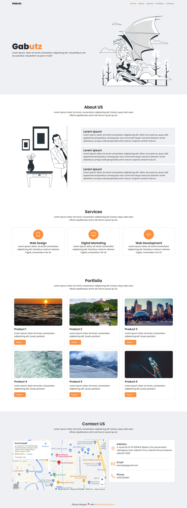

 
  

  &#xa0;

  <a href="https://gabutz.netlify.app/">Demo</a>

<h1 align="center">Gabutz</h1>

  

  

  

  

  

  

<!-- Status -->

<!-- <h4 align="center"> 
	🚧  Gabutz 🚀 Under construction...  🚧
</h4> 

 -->

  <a href="#dart-about">About</a> &#xa0; | &#xa0; 
  <a href="#rocket-technologies">Technologies</a> &#xa0; | &#xa0;
  <a href="#memo-license">License</a> &#xa0; | &#xa0;
  <a href="https://github.com/suryamsj target="_blank">Author</a>

 

## :dart: About ##

Gabutz adalah template landing page yang dibuat ketika sedang iseng dan gabut gak tau mau ngapain :smile:.

## :rocket: Technologies ##

The following tools were used in this project:

- [Bootstrap 5](https://getbootstrap.com/)
- [Storyset](https://storyset.com/)

## :memo: License ##

Project ini berlisensi MIT, untuk lebih lengkapnya silahkan ke file [LICENSE](LICENSE).

Dibuat dengan :heart: oleh <a href="https://github.com/suryamsj" target="_blank">Muhammad Surya</a>

&#xa0;

<a href="#top">Back to top</a>
